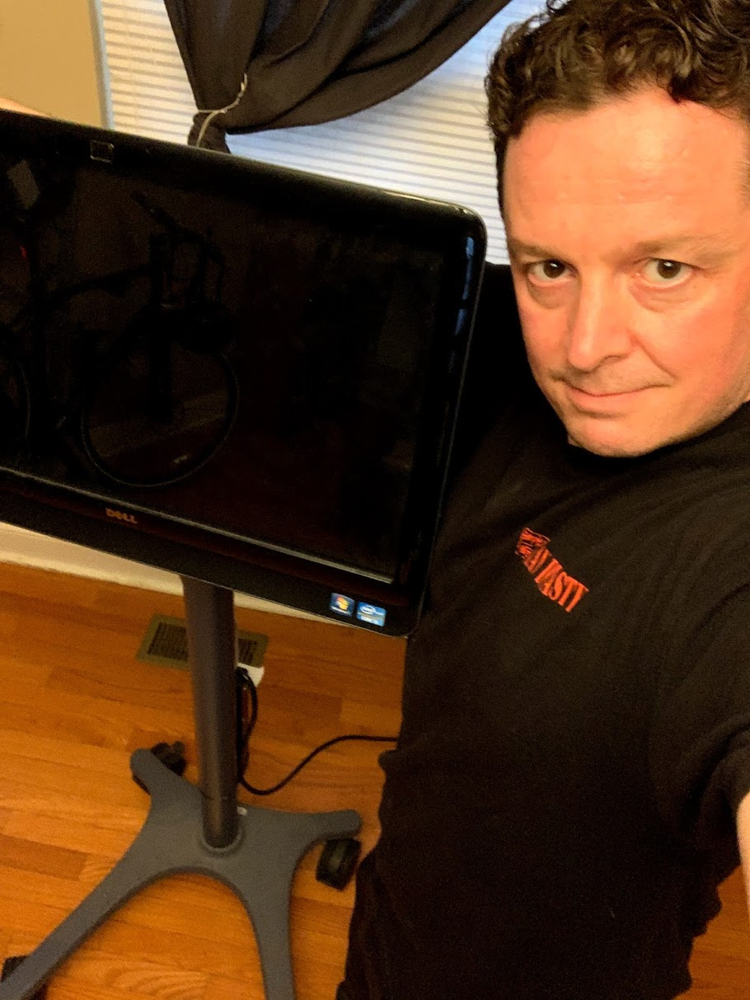

# Building Your Own Zoom Appliance (aka, the Zoom-bot!)

These instructions will help you build your own Zoom-bot. The goal is to turn a Windows 11 computer into an appliance with one purpose: joining Zoom meetings. The script is written to keep the end product as straightforward as possible, with the goal of non-technical users being able to use the device.

I will try to keep these instructions as clear as possible, but you're going to need intermediate technical know-how of Windows to make this happen. If you've installed Windows on your own, and know what a command prompt is, you're probably advanced enough to build your own Zoom-bot. If you haven't, there are many YouTube videos and tutorials online which might help.

## Materials Required

* A Windows 11 compatible computer
    * Dell All-in-One machines with touch screens work wonderfully for this, as they have high quality JBL speakers, a touch screen, WiFi, and a decent web camera. [You can find these on eBay](https://www.ebay.com/sch/i.html?_nkw=dell+all+in+one+touch+screen&_sacat=0&_odkw=dell+all+in+one+touchscreen&_osacat=0)), but *BE CAREFUL* to fully read the description *IN FULL*.
    * Other All-In-One machines will work as well, but many are not touch screen, which will also require a mouse.
* An omnidirectional microphone, to pick up speech in the room, [such as this one](https://smile.amazon.com/gp/product/B00N1YPXW2/).
    * You will want a longer USB cable for this microphone, to be able to extend it to the center of the room, [such as this one](https://smile.amazon.com/gp/product/B002KL8N6A/).
* A mount with wheels and VESA mounting interface, [such as this one](https://smile.amazon.com/Rfiver-Rolling-Universal-Display-Trolley/dp/B07JHWCQW5/).
* A power strip with a long lead cable, [such as this one](https://smile.amazon.com/Kensington-Guardian-15-Foot-Protector-K38215NA/dp/B00PBWV6SW/).
* Zip ties to keep cabling contained, [such as these](https://smile.amazon.com/Pounds-Tensile-Strength-Pieces-Karoka/dp/B08K4PTCW1/).
* A USB flash drive to install Windows 10. [You can create Windows 10 installation media with this tool](https://go.microsoft.com/fwlink/?LinkId=691209).

## Installation

* Boot to the USB flash drive to and install a fresh, clean copy of Windows 10. [This may help](https://www.windowscentral.com/how-do-clean-installation-windows-10), but you'll need some Windows expertise.
* After the initial setup, the computer will reboot and prompt you to finish your installation.
    * First, you'll have to select your country and keyboard layout.
    * After this, it is VERY important to say YOU DO NOT HAVE AN INTERNET CONNECTION.
    * This is the only way to set up a local account without a passowrd. It will prompt you several times trying to get you to create a Microsoft Online account. DO NOT. Just create the local account.
    * Continue, and set up a local account, and when it prompts you for a password, leave it blank.
    * You will be able to connect to the internet after the installation is complete.
* Continue through the prompts until Windows starts up.
* Once Windows has started, you can continue with the [rest of the script to install Zoom and your meeting icons](https://github.com/FlipperPA/windows-zoom/blob/main/README.md).
